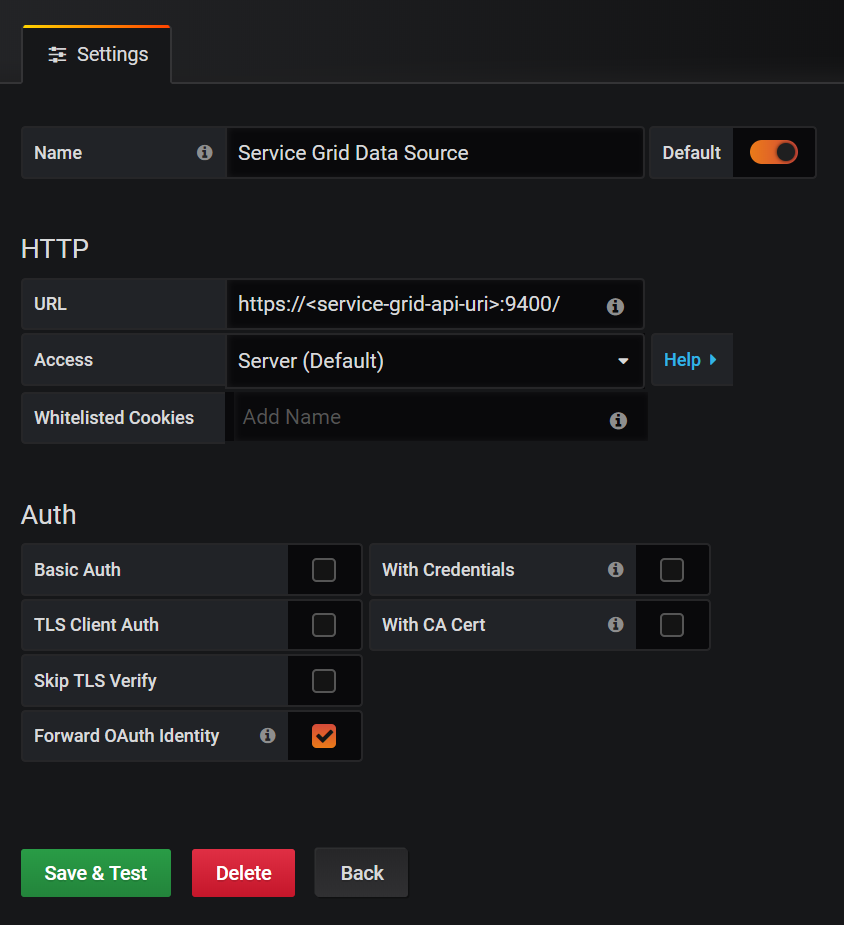
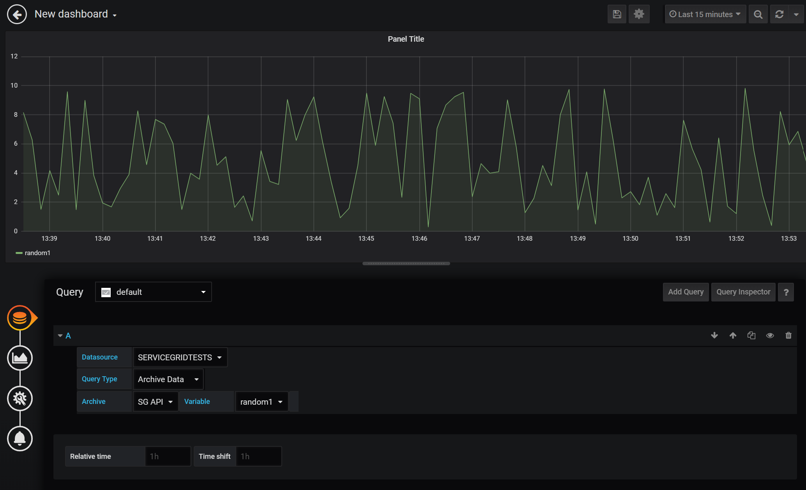
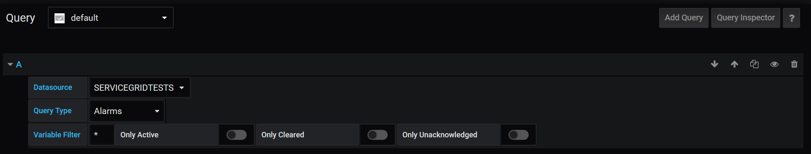
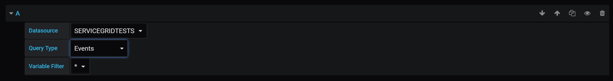
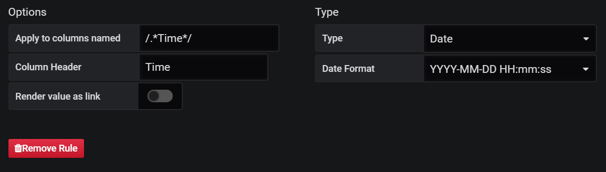

# Service Grid API Datasource for Grafana

This Datasource provides support for COPA-DATA's Service Grid API to request metrics from Service Grid installations.

For general information on Service Grid and the involved components, please refer to https://www.copadata.com/en/ or sales@copadata.com.


## Prerequisites
The following prerequisites need to me met in order to use this datasource:
- working Service Grid installation with Service Grid API >= 1.0.1908.31001
- Grafana Version >= 6.1.0


## Supported data queries
The following data can be retrieved from Service Grid API via this datasource:
- Historic variable values
- Alarm entries
- Event entries

To show alarm and event entries, the usage of Grafana's table panel is recommended.


## Installation
To use this datasource, perform the following steps:

1. Clone this git repository to a local folder, or download a copy of it as ZIP file
2. Install the plugin by manually copying the folder `dist` to Grafana's plugin folder (e.g. `.../grafana/data/plugins/`). You may rename `dist` as you like.<br>
See https://grafana.com/docs/plugins/installation/ for reference


## Configuration

Prior to using the Service Grid Datasource, the following things need to be configured:
- OAuth2 client definition for Grafana using Service Grid Configuration Backend
- OAuth2 configuration for Grafana
- Datasource configuration

### Configure Grafana OAuth2 client using Configuration Backend

In order that Grafana may use the Service Grid Identity Service for user authentication, a client definition needs to be setup using the Configuration Backend.
For this client configuration, it is important to set the correct client id, redirect uri and scopes for Grafana. The client secret, which is required for `custom.ini` is generated during this configuration step.

See the following table for reference:

| Field | Value | Note (or reference to `custom.ini`) |
| - | - | - |
| Application ID | grafana | arbitrary client id, must be the same as `client_id` |
| Application Name | Grafana | arbitrary name |
| Redirect URIs | https://\<grafana-uri\>:\<grafana-port\>/login/generic_oauth | see https://grafana.com/docs/auth/generic-oauth/ for reference |
| Allowed scopes | API openid profile email offline_access | the same as in `scopes` |
| Grant types | Code | required by Grafana |
| Secret | generated value | must be copied to `client_secret` |
| Allow access tokens via browser | checked | required to pass OAuth tokens via browser requests |

For additional information on the Configuration Backend, please refer to the Service Grid manual.

### Configure Grafana for OAuth2 Authentication

Grafana supports the OAuth2 authentication mechanism for authenticating users against OAuth2 Identity providers. Grafana plugins allow to forward those OAuth2 tokens to the respective API endpoints, where they would query the data from. In terms of Service Grid, Grafana must be able to authenticate a user against the Service Grid Identity Service and has to forward this OAuth2 token via the Datasource Plugin to the Service Grid API, to read data from it.
In fact this means that the Grafana Backend needs to be configured to use OAuth2 (https://grafana.com/docs/auth/generic-oauth/).
See the following configuration section from the configuration file *custom.ini*:

```INI
[server]
protocol=https
cert_file=<path>\cert.pem
cert_key=<path>\server.key
domain=<grafana domain>
root_url=%(protocol)s://%(domain)s:3000/

[auth.generic_oauth]
enabled=true
client_id=grafana
client_secret=<client secret>
scopes=API openid profile email offline_access
auth_url=https://<domain-of-identity-service>:9430/connect/authorize
token_url=https://<domain-of-identity-service>:9430/connect/token
api_url=https://<domain-of-identity-service>:9430/connect/userinfo
allowed_domains=<list of allowed email domains>
allow_sign_up=true
send_client_credentials_via_post=true
```

After the successful configuration, Grafana needs to be restartet, so that the changes take effect.


### Configuration Datasource

Once the Datasource plugin is installed, as outlined in section **Installation**, the datasource can be created using the Grafana UI.
In order that the Datasource can authenticate requests at the Service Grid API, it is required that OAuth authentication tokens are forwarded.
This is done by checking the option "Forward OAuth Identity" in the Datasource configuration.




## Using the Datasource to query data

To create data queries, this datasource provides a query editor with the following options:

| Option | Description | Note |
| - | - | - |
| Datasource | Selection of the available zenon Datasources for the current user |
| Query Type | Selection of the desired data request (`Archive Data` \| `Alarms` \| `Events`) |
| Archive | Selection of available archive for the selected zenon Datasource | only available for Query Type `Archive Data` |
| Variable | Selection of available variables for the selected zenon Datasource and archive | only available for Query Type `Archive Data` |
| Variable Filter | Allows filtering the resulting data for a specific variable. The filter allows to use an `*` as wildcard | only available for Query Types `Alarms` and `Events` |
| Only Active | Only active alarms are shown | only available for Query Types `Alarms` |
| Only Cleared | Only cleared alarms are shown | only available for Query Types `Alarms` |
| Only Active | Only unacknowledged alarms are shown | only available for Query Types `Alarms` |
 

The following images show the query editor for the different Query Types.

- Query Type `Archive Data`:

  

- Query Type `Alarms`:

  

- Query Type `Events`:

  


# Building the Datasource

## Preparation
- Development Environment, which supports Debugging of Chrome Webpages (e.g. Visual Studio Code)
- Development tools:
    - node: 10.16.3
    - npm: 5.8.0
    - grunt: v1.0.4
    - grunt-cli: v1.2.0
    - tsc v.3.6.2

## Build Steps

1. Clone this git repository to a local folder
2. Open the folder in an IDE (e.g. VS Code)
3. Run `npm install`
4. Build the datasource by running `grunt`
5. Install the datasource by copying the `dist` folder to Grafana's plugin folder.<br> You can also create a static link from the Grafana plugin folder to the local `dist` folder. This way there is no need for a copy step and changes to the sources are directly reflected after a rebuild.<br>See https://grafana.com/docs/plugins/installation/ for reference.
6. Start debugging the plugin using VS Code and the Chrome Debugging Tools.
    
    See the following *launch.json* configuration for reference.
    ```JSON
    {
      "version": "0.2.0",
      "configurations": [
      {
        "type": "chrome",
        "request": "launch",
        "name": "Launch Chrome against localhost",
        "url": "https://localhost:3000/",
        "webRoot": "${workspaceFolder}/dist",
        "smartStep": true
      }]
    }
    ```


# Troubleshooting

## Why are there no Datasources listed in the dropdown?
Make sure that the user, which is trying to request data from the Service Grid API, has sufficient permissions and is assigned to the desired datasources in the Configuration Backend.
Try to perform requests using the Service Grid API's Swagger UI client, to eliminate any configuration mistakes for the Service Grid Datasource plugin.

## Why am I not able to connect to grafana even if it is started?
Make sure that the used port (default: *3000*) is available and not used by any other services.

## The Datasource does show errors when requesting data and the last log in was approx. 1 hour ago.
Check in the Configuration Backend if the Grafana client definition includes the scope `offline_access` and it is allowed to use refresh tokens. Also Grafana's configuration file must include the scope `offline_access`.

## Timestamps of Alarms and Events are displayed as numbers (e.g. *'1.57 Tri'*)
Timestamps of alarm and event entries are encoded as UNIX timestamps. Using the table panel requires to specify column styles, which format those timestamps in the desired date format.
The format `/.\*Time\*/` allows all relevant columns to be formated as date time.


